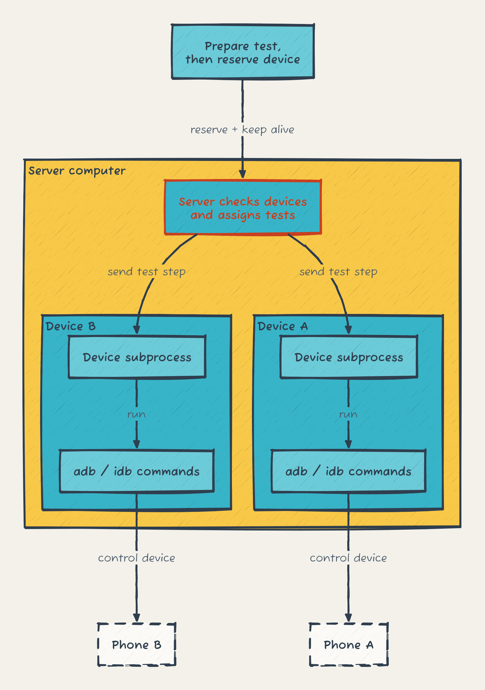
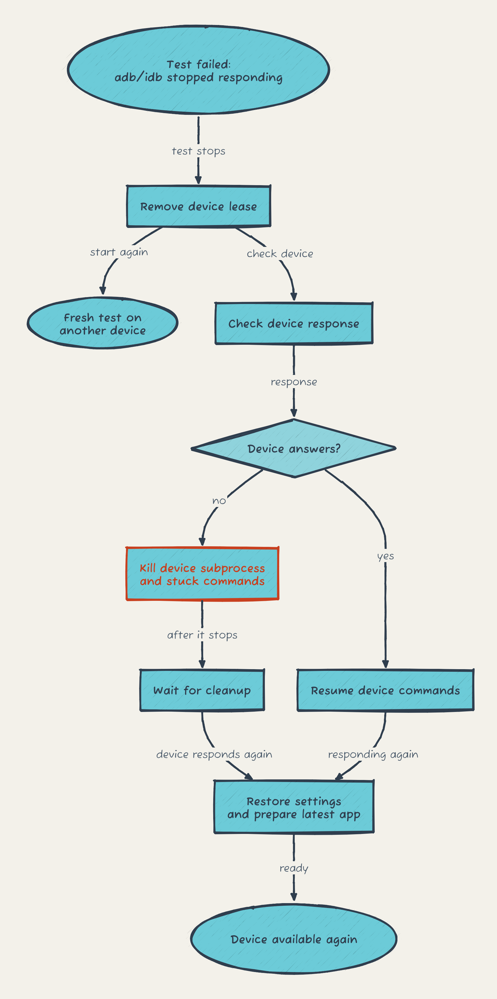

# How the server runs tests

The server checks which devices can run tests and assigns each test a device. Each device has its own subprocess to run adb/idb commands, so one stuck device does not block the others. The client prepares the test plan before reserving a device and keeps that reservation alive while the test runs.

# When a device stops responding

The failed test loses its device reservation. A suite can start that test from the beginning on another device, without spending a retry, at most twice per test. This still happens if the original device starts responding during the server's check.

The server checks the device separately. If it still does not respond, the server kills its subprocess and any adb/idb commands it started, then waits for cleanup. Once the device responds again, the server restores settings and makes sure it has the latest uploaded app before assigning another test.

An app install that exceeds four minutes also kills the device subprocess and its children. A test request reaching its own time limit can leave the command running; that device stays unavailable until the command finishes or the server confirms it has stopped responding.

Edit [server-supervision.d2](server-supervision.d2) or [server-recovery.d2](server-recovery.d2), then render with `d2 source.d2 output.png`. Both import the shared [_style.d2](_style.d2).
