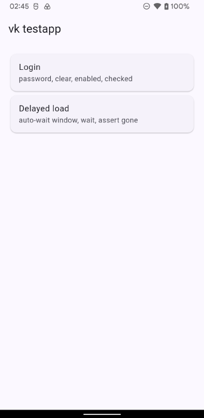
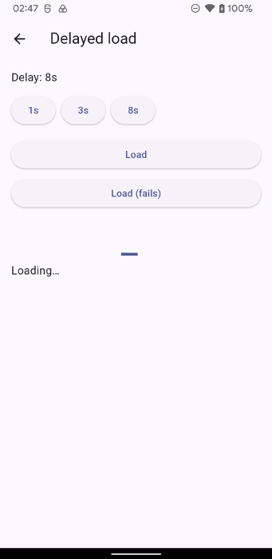

# vk testapp — a controlled fixture for verifying verikun

**This is a test fixture, not part of the `vk` CLI or the Claude Code plugin.** It
has its own toolchain and is never built by `npm` anything. Think of it as a
ruler: its job is to be a known, unchanging shape that `vk` can be measured
against — not software under test in its own right.

It exists because the rest of the repo's device coverage relied on whatever
happened to be installed on the tester's phone — `example/example-test.md` used to
drive the stock camera and really delete photos, and nothing pinned `vk`'s
behaviour against an app whose semantics we control.

Two things drive it now, and both are non-destructive:

- [`tests/e2e/`](../../tests/e2e/) — the typed harness that asserts exit codes and
  stderr, run with `npm run test:e2e`.
- [`../example-test.md`](../example-test.md) — the natural-language `vk ai` test,
  which targets this app too and runs on both platforms.

## The app

| Home | Login | Delayed load |
|:---:|:---:|:---:|
|  |  |  |
| Reset anchor — `vk launch` always lands here | A prefilled field, an obscured field, a checkbox, and a submit button disabled until both fields are filled | Pick a delay, start a load, watch a spinner — the 8s preset outlasts vk's default wait window on purpose |

Three screens, each earning its place by pinning a specific part of vk's contract:

| Screen | Ids | What it pins |
|---|---|---|
| `@vk_home` | `vk_nav_login`, `vk_nav_async` | Reset anchor — `vk launch` always lands here |
| `@vk_login` | `vk_user` (prefilled), `vk_pass` (obscured), `vk_remember`, `vk_submit` (disabled until valid), `vk_login_ok` | `password` flag + report redaction, `text --clear`, `find --enabled`, `checked` |
| `@vk_async` | `vk_delay_1/3/8`, `vk_load`, `vk_fail`, `vk_spinner`, `vk_loading_text`, `vk_loaded`, `vk_error` | The ~5000 ms auto-wait window, `--wait`, `assert --gone`, dumping while animating |

The delays are `Future.delayed`, **not** network calls — the fixture is hermetic
and works on a device in airplane mode.

The 8s preset is the important one: it is longer than vk's default wait window,
so it proves the default both *fires* (exit 1) and is *overridable*
(`--wait 15s` → exit 0). Nothing else on-device pins that.

## Prerequisites

- **Flutter** — follow the
  [official install guide](https://docs.flutter.dev/get-started/install). Then
  `fvm flutter doctor` should be clean for the platforms you intend to build.
- **[fvm](https://fvm.app/documentation/getting-started/installation)** — see
  below; the Flutter version is pinned per-project rather than globally.
- **iOS** additionally needs Xcode and CocoaPods. Simulator only — a physical
  device would need code signing, which is out of scope.

### The Flutter version is pinned with fvm

`.fvmrc` is committed and pins this project to a specific Flutter release. Install
[fvm](https://fvm.app/documentation/getting-started/installation), then once in
this directory:

```sh
cd example/flutter-app
fvm install          # reads .fvmrc, downloads that exact Flutter version
```

**Always invoke `fvm flutter …` / `fvm dart …`, never bare `flutter`.** Bare
`flutter` resolves whatever your machine's default SDK happens to be and quietly
defeats the pin.

Why bother: a globally-installed Flutter forces every project on the machine to
move together, so upgrading one app's SDK drags all the others along with it.
Pinning per-project means this fixture can stay on a known-good Flutter — and be
upgraded deliberately, in its own commit, when we want to re-measure against a
newer one — without touching anything else you build on the same machine. It also
makes "works on my machine" reproducible: everyone and every CI job builds with
the same SDK.

`.fvmrc` is committed; `.fvm/` (a machine-local symlink to the downloaded SDK) is
not.

## Build and install

```sh
# Android
npm run flutter-app:apk
node dist/bin/verikun.js install \
  example/flutter-app/build/app/outputs/flutter-apk/app-debug.apk -d <serial>

# iOS simulator
npm run flutter-app:ios
node dist/bin/verikun.js install \
  example/flutter-app/build/ios/iphonesimulator/Runner.app --ios
```

`vk install` takes the `.app` **directory** directly on iOS — there is no
extension check, and `idb` handles bundles. (Remote install via `vk server` is
`.apk`/`.ipa` only, since a directory can't be streamed.)

Then:

```sh
VK_E2E_DEVICE=<serial> npm run test:e2e     # Android
VK_E2E_PLATFORM=ios    npm run test:e2e     # iOS simulator
```

A fresh clone must go through `fvm flutter build` at least once — the Gradle
wrapper and `local.properties` are generated, not committed, so `./gradlew`
directly will not work until then.

### Two `adb` binaries will bite you

`vk` uses whichever `adb` is on `PATH`; Gradle uses the one in the Android SDK. If
they are different versions they fight over the adb server and kill connections
mid-run. Make `adb version` agree, or set `ANDROID_HOME` and put its
`platform-tools` first on `PATH`.

## Design constraints

**The app is stateless.** No `shared_preferences`, no files, no database. This is
load-bearing, not laziness: `vk clear` (`pm clear`) throws on iOS — there is no
per-app data reset — so `vk suite --app` degrades to a force-stop there. With all
state in memory, `vk launch` (which force-stops before launching) is a complete
and *identical* reset on both platforms.

**Everything is wrapped in `MergeSemantics`.** See `lib/widgets.dart`; the reason
is measured fact 2 below.

**Animations are off by default.** The spinner on the async screen is the one
exception, and it is there deliberately to test dumping against an animating UI.

## Measured Flutter facts

Everything here was observed by running `vk` against this app. Verified on a
**Pixel 3a (Android 12)**, a **Samsung SM-A415F (Android 12, Swedish locale)** and
an **iPhone 17 Pro simulator (iOS 26.5)**, with Flutter 3.44.8.

Facts 6, 9, 10 and 11 are `vk` gaps rather than fixture quirks, and each links to
the issue tracking it.

### 1. Flutter emits no semantics tree at all unless you ask for it

Flutter only builds a semantics tree while some client holds a `SemanticsHandle`
— normally TalkBack or VoiceOver. Without one, `uiautomator dump` sees a single
empty `FlutterView` and `vk ui` prints `(no elements)`.

`lib/main.dart` calls `SemanticsBinding.instance.ensureSemantics()` at startup and
never disposes the handle. **This is why the app is inspectable at all.** It also
means this fixture represents a *well-instrumented* Flutter app; a real one that
skips this step is invisible to `vk` — a good future diagnostic for `vk` to detect
by name.

### 2. `Semantics(identifier:)` alone splits into two nodes — merge it

A bare `Semantics(identifier: 'x', child: …)` emits **two sibling nodes** on
Android: one with the identifier and nothing else, one with the label, tap action
and state flags. The first run of this app showed:

```
[8] Button @vk_submit (540,891) disabled
[9] Button desc="Sign In" (540,891) disabled
```

This is not cosmetic. `@vk_remember` came back with **no checked state at all**,
because the checkbox flags lived on the sibling node — so `vk assert @vk_remember`
could never observe it. Wrapping in `MergeSemantics` collapses the pair:

```
[6] CheckBox @vk_remember desc="Remember me" (540,726) tap,unchecked
[7] Button   @vk_submit   desc="Sign In"     (540,891) disabled
```

### 3. An identifier-only node survives on Android and vanishes on iOS

A node carrying an identifier but no label, no value and no action appears in
`uiautomator dump` as `View @vk_home`, but is **absent from
`idb ui describe-all` entirely**. The screen containers and the spinner all hit
this. Anything that must be findable on both platforms needs a `label` (or must
wrap a widget that supplies one) — which is why the screen anchors live on the
AppBar title and `VkSpinner` carries `label: 'Busy'`.

### 4. A label lands in a different field per platform

| | Android | iOS |
|---|---|---|
| `Semantics(label: 'Sign In')` | `desc="Sign In"` | `text="Sign In"` |

Same app, same widget:

```
Android:  [7] Button @vk_submit desc="Sign In" (540,891) disabled
iOS:      [6] Button "Sign In" @vk_submit (201,358) tap,disabled
```

`@vk_submit` works on both. This is the whole reason for the **`@id` first,
`text:` second, `desc:` never** rule.

### 5. Flutter reports text inputs as real input classes

`android.widget.EditText` on Android, `TextField` on iOS. This matters because
`isInteresting()` keeps a node whose class matches
`EditText|AutoComplete|TextField|Edit$` even when it has no text, id or label.

Everything else is `android.view.View` on Android — so **`class:Button` can never
match a Flutter node**.

### 6. `obscureText` sets the password flag on Android — but NOT on iOS

> Tracked in [#44](https://github.com/ddikman/verikun/issues/44).

Android reports `password="true"`, so `vk`'s redaction fires and the run report
records `typed «redacted»` with the value nowhere in `run.json`, `report.xml` or
`report.html`. Verified end-to-end.

**On iOS it does not.** `ios-parse` derives `password` from
`type === 'SecureTextField'`, but `idb` reports a Flutter obscured field as a
plain `TextField`:

```
[4] TextField "Password" @vk_pass (201,234) tap        <- no `pwd` flag
```

So **`vk`'s secret redaction does not currently fire for a Flutter app on iOS.**
The e2e suite pins this as-is rather than pretending otherwise; the day it is
fixed, that test will fail and say so.

### 7. On iOS you cannot read a field's value

`ios-parse` sets `text = AXLabel || title || AXValue`, and the label wins. A field
labelled "Username" containing `prefilled@example.com` reports `text="Username"`.
Consequences: there is no way to read back what was typed, and `text --clear`
(which is gated on the resolved element's `text`) would size its deletion from the
*label*. The `--clear` case is Android-only for this reason.

On Android the value does surface in `text`, so `--clear` works correctly.

### 8. An animating spinner does not break the dump

A continuously-animating `CircularProgressIndicator` was expected to stop
`uiautomator` reaching idle and trip the 3-attempt retry in `AdbDriver.dumpXml`.
It does not — `vk find @vk_spinner --no-wait` resolves fine mid-animation on both
platforms, with system animation scales zeroed via `vk doctor --fix`.

### 9. `vk text` intermittently duplicates the final character

> Tracked in [#46](https://github.com/ddikman/verikun/issues/46).

Typing `replaced@example.com` occasionally yields `replaced@example.comm`. Low-rate
and timing-dependent — and **not** `adb`'s fault:

| variant | duplicated |
|---|---|
| raw `adb shell input text` | 0/5 |
| `vk text`, screen settled with `assert` first | 0/10 |
| `vk text`, fixed `sleep`s instead of asserts | 1/8 |

The prime suspect is `cmdText`'s three-round-trip priming sequence
(`inputText(' ')` → `backspace` → `inputText(value)`), which exists because adb
sometimes drops the first character — i.e. that path is already known to race.

The e2e case asserts replacement semantics (old value gone, new value a prefix)
rather than exact equality, so the suite isn't flaky for a reason unrelated to what
it tests. That also means the suite will not catch a regression here.

### 10. The first dump after `launch` returns the PREVIOUS screen

> Tracked in [#45](https://github.com/ddikman/verikun/issues/45).

On a cold `vk launch` the Pixel 3a skipped ~300 frames (`Davey! duration=1950ms`).
A dump issued in that window returns the previous hierarchy — not an error, not an
empty result, but a different screen's elements entirely. Directly observed, with
the app left on the login screen and then relaunched:

```
pre-launch screen: @vk_login
  dump 1: @vk_login     <- stale: the app was just force-stopped and relaunched
  dump 2: @vk_home
  dump 3: @vk_home
```

The very first run of this fixture hit the extreme version of this: a dump right
after `launch` returned a **completely different application's** hierarchy, which
looked for all the world like the fixture had failed to install.

`openScreen()` in the harness waits up to 20s on the first assert for this reason.

### 11. A tap immediately after `launch` can report success and do nothing

> Tracked in [#45](https://github.com/ddikman/verikun/issues/45) — same root cause
> as fact 10.

Tapping the same element two ways, immediately after `launch`, four trials each:

```
  @vk_nav_login -> navigated 4/4
  text:Login    -> navigated 0/4
```

Both selectors resolve to the **identical element at identical coordinates** on a
settled screen (`vk_nav_login`, center 540,385) — verified with `find --json`. Yet
`vk tap text:Login` exits **0** and prints

```
tapped [2] Button @vk_nav_login desc="Login…" (540,385) tap (healed: partial match) (waited 3.0s)
```

…while the app stays on the home screen. **That is a false green**: an agent
driving this proceeds believing it navigated.

The likely mechanism is fact 10 — during the stale window `text:` matches an
element on the *old* screen (the login AppBar title is also "Login") and taps a
coordinate that means something else once the new screen renders, whereas an `@id`
unique to the target screen finds nothing and correctly keeps waiting. **That
explanation is not fully confirmed**: it does not account for why the failure
repeats when the previous screen is already home. Recorded as observed rather than
as a settled diagnosis.

Two practical consequences:

- **Assert the screen before acting on it.** `launch` → `assert @screen` → `tap`
  is reliable; `launch` → `tap` is not. The e2e harness does the former.
- **A screen-unique `@id` degrades safely; an ambiguous `text:` does not.** Another
  point for the `@id`-first rule — here it is the difference between waiting
  correctly and silently tapping the wrong pixel.
